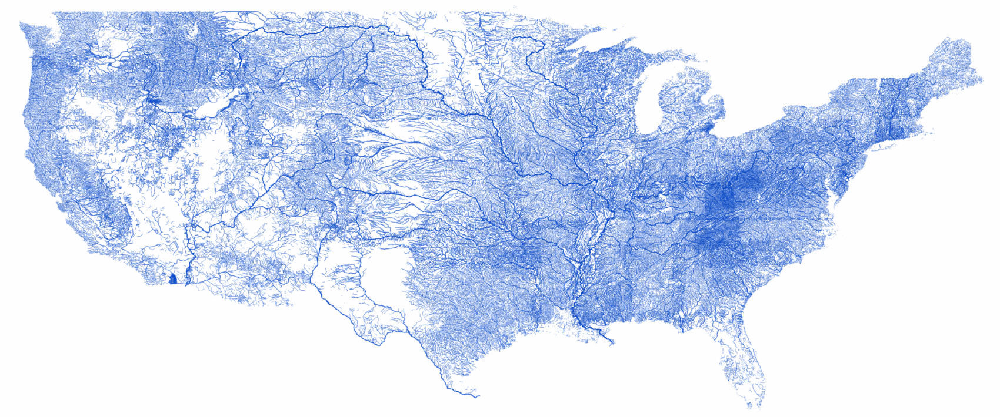

# Streams

Generate beautiful images from PostGIS, ideally suited for rendering rivers and streams.



*(High-res image is available [here](us-rivers-high-res.png))*

## Getting Started 

### Caveats

The current version only supports geometries of type LINESTRING.

### Prerequisites

[Libgeos](https://trac.osgeo.org/geos/) is required. Download the latest version, build it and install it using the default settings. The Makefile looks for the library in /usr/local/lib.

The commandline tool  `gen_image` requires a connection to a PostgreSQL database. 

Generate an image from a table `nhdflowline` with a 1-pixel width:

```bash
./gen_image -pg "host=localhost user=admin dbname=mydb password=XXX" -query "select shape, 1 from nhdflowline where id = 2" -f output.png 
```

Generate an image from a table centered around New York with a width calculated using the length. The `ST_Simplify` function improves rendering performance for large geometries.

```bash
./gen_image -pg "host=localhost user=admin dbname=mydb password=XXX" -query \
"select st_astext(st_simplify(shape,0.005)), \
case \
when stream_length < 10000 then 0.5 \
when stream_length < 100000 then 2 \
else 3 \
end as length \
from nhdflowline s join tl_2018_us_state us on s.shape && us.wkb_geometry \
where us.stusps = 'NY'" \
-progress -f foo.png
```

### Installing

Build using XCode or the included Makefile

## Built With

* [GEOS](https://trac.osgeo.org/geos//)
* [PostGIS](https://maven.apache.org/)

## Authors

John Robokos

## License

This project is licensed under the MIT License - see the [LICENSE](LICENSE) file for details
